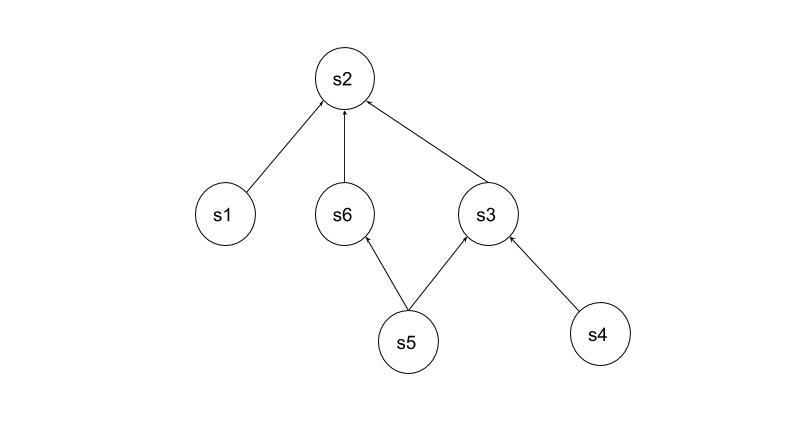

# topology
topology yaml




```yaml
services:
  - name: s1
    repo: 'https://github.com/app1/s1'
    path: ./                    # if multiple services share same repo
    dependencies:
      - s2!                     # `!` indicates build + deploy dependency and no `!` indicates only deploy dependency
      - s3                
  - name: s2
    repo: 'https://github.com/app1/s2'
    path: ./
    dependencies: {}
  - name: s3
    repo: 'https://github.com/app1/s3'
    dependencies:
      - s2
        type: build
  - name: s4
    repo: 'https://github.com/app1/s4'
    dependencies:
      - name: s3
        type: build
  - name: s5
    repo: 'https://github.com/app1/s4'
    path: <path-to-service>
    dependencies:
      - name: s6
        type: build
      - name: s3
        type: build
  - name: s6
    dependencies:
      - name: s2
        type: build
tests:
  s1-test: #TODO can move under respective service in services section
    repo: 'https://github.com/app1/app1-tests'
    path: s1-test1/
    dependencies:
      - s1
  s2-test:
    repo: 'https://github.com/app1/app1-tests'
    path: s2-test1/
    dependencies:
      - s2
  smokeTest:
    repo: 'https://github.com/app1/app1-tests'
    path: smoketests/
    dependencies: #TODO: some keyword to represent all services or entire application
      - s1
      - s2
      - s3
      - s4
      - s5
      - s6
      - s7
  performanceTest:
    repo: 'https://github.com/app1/app1-tests'
    path: performanceTests/
    dependencies:
      - s1
      - s2
      - s3
      - s4
      - s5
      - s6
      - s7
```
